# Argus — Technical Reference

This document explains **exactly** how Argus works right now: every moving
part, every formula, every config file, and why each decision was made. It's
a companion to [`README.md`](README.md) (quickstart) and
[`BUILD_PLAN.md`](BUILD_PLAN.md) (phase roadmap) — this one is the "open the
hood" reference.

Written to answer, precisely: what is running, where does each number on the
dashboard come from, and what is real vs. configured-by-a-human.

> **Scope note.** Sections 1-13 below describe the metrics pipeline and the
> docker-compose deployment. Argus has since gained logs (Loki), traces
> (Tempo), a Kubernetes/ArgoCD deployment, and an AIOps agent — see §14-17
> at the end. Where the two disagree, the later sections win.

---

## 1. System overview

```mermaid
flowchart LR
    subgraph fleet["Database fleet (11 targets)"]
        direction TB
        pgl["pg-local\nPostgres 16"]
        myl["mysql-local\nMySQL 8.4"]
        mol["mongo-local\nMongo 7"]
        rc["redis-cache-local\nRedis 7"]
        rs["redis-session-local\nRedis 7"]
        pgn["pg-neon (cloud)"]
        pgs["pg-supa (cloud, broken)"]
        mo["mongo-orders (cloud)"]
        mc["mongo-catalog (cloud)"]
        rcc["redis-cache (cloud, broken)"]
        rcs["redis-session (cloud, broken)"]
    end

    collector["collector (Python)\none asyncio poll loop per target\nclassify.py grades each sample\nexporter.py holds latest values"]

    prom["Prometheus\nscrapes collector:9100 every 15s\nremote_write's to Mimir"]
    mimir["Mimir\nlong-term metric storage\nsingle-binary mode"]
    grafana["Grafana\nqueries Mimir via PromQL\nrenders 2 dashboards"]

    loadgen["loadgen/generate.py\nbaseline traffic + chaos\n(runs on host, not in compose)"]

    fleet -->|"native protocol\n(SQL / Mongo wire / RESP)"| collector
    collector -->|"HTTP GET /metrics\n(pull, on Prometheus's clock)"| prom
    prom -->|"HTTP POST\nremote_write"| mimir
    grafana -->|"PromQL over HTTP"| mimir
    loadgen -.->|"generates real traffic"| fleet
```



Nothing in this chain is faked. Every hop is a real network call carrying
real data:

1. The collector opens a real connection to each database and runs the
   database's own diagnostic commands (`pg_stat_activity`, `SHOW GLOBAL
   STATUS`, `serverStatus()`, `INFO`).
2. Prometheus makes a real HTTP GET to the collector's `/metrics` endpoint.
3. Prometheus makes a real HTTP POST (`remote_write`) to Mimir.
4. Grafana makes a real PromQL query over HTTP to Mimir every time a panel
   refreshes (every 10s, per dashboard `refresh` setting).

Section 12 shows the exact commands used to prove this end-to-end by
watching one live value change identically at every hop.

---

## 2. The database fleet

Declared in one file: [`deploy/fleet.yaml`](deploy/fleet.yaml). Nothing about
the fleet exists in Python — `collector/fleet.py` and `loadgen/generate.py`
both parse this file at startup.

### 2.1 Local fleet (always up, no credentials needed)

| id | image | engine | host port | container port | credentials |
|---|---|---|---|---|---|
| `pg-local` | `postgres:16-alpine` | postgres | 55432 | 5432 | `argus`/`argus` |
| `mysql-local` | `mysql:8.4` | mysql | 53306 | 3306 | `argus`/`argus` (root: `argus-root`) |
| `mongo-local` | `mongo:7` | mongo | 57017 | 27017 | `argus`/`argus` |
| `redis-cache-local` | `redis:7-alpine` | redis | 56379 | 6379 | none (no auth) |
| `redis-session-local` | `redis:7-alpine` | redis | 56380 | 6379 | none (no auth) |

These credentials are **intentionally not secrets** — the containers only
listen on the private `docker-compose` network (plus a published host port
for `loadgen`/debugging), and hold nothing but generated load data. They're
committed in plain text in `fleet.yaml` and `docker-compose.yml` on purpose.

Each has a `healthcheck` in `docker-compose.yml` (e.g. `pg_isready`,
`mysqladmin ping`, `mongosh ... ping`, `redis-cli ping`). The `collector`
service has `depends_on: <service>: condition: service_healthy` for all
five, so it never starts polling before a database can actually answer.

Host ports are shifted into the `5xxxx` range specifically so they never
collide with a real local install of the same engine (e.g. a real Postgres
on 5432).

### 2.2 Hosted fleet (optional, free-tier cloud)

| id | provider | env var | current state |
|---|---|---|---|
| `pg-neon` | Neon | `NEON_DSN` | live (was cold-starting; SLO widened) |
| `pg-supa` | Supabase | `SUPA_DSN` | **broken** — DNS doesn't resolve, project likely deleted |
| `mongo-orders` | Atlas M0 | `MONGO_URI` | live |
| `mongo-catalog` | Atlas M0 | `MONGO_URI` (same cluster, different db) | live |
| `redis-cache` | Upstash | `REDIS_CACHE_URL` | **broken** — `AuthenticationError`, password rotated/wrong |
| `redis-session` | Upstash | `REDIS_SESSION_URL` | **broken** — still the literal placeholder `yyy.upstash.io`, never filled in |

`collector/fleet.py::_interpolate()` resolves `${ENV_VAR}` against the
process environment (populated from `.env` via `python-dotenv` locally, or
`env_file: .env` in `docker-compose.yml`). If the variable is unset or
empty, `_Unresolved` is raised and `build_fleet()` catches it and **skips
that target entirely** — it never becomes a poller, never appears in
`/metrics`, and doesn't block the other 10 targets from starting. This is
why a clean checkout with no `.env` still runs the full local fleet.

The three broken hosted targets are *not* skipped (their env vars ARE set,
just wrong) — they resolve to real pollers, poll every cycle, fail with a
real driver exception, and get reported as `critical` / `unreachable:
<ExceptionClassName>`. Fixing them means updating the actual connection
string values in `.env`, not code.

### 2.3 SLO tiering (why cloud and local don't use the same thresholds)

A container on `localhost` reports 2-10ms latency. A free-tier database two
regions away reports 90-900ms *on a good day*. One threshold can't
classify both meaningfully — either the cloud targets are permanently red,
or the local ones would have to tolerate real degradation without
complaint. `deploy/fleet.yaml` lets any target attach a `slo:` block that
widens specific budgets, each with a one-line rationale comment (see the
file). `collector/config.py::slo_for()` merges it on top of the engine
default. **Direction** (`higher_is_worse`) is never overridable — that's a
property of the SLI itself, not of geography.

---

## 3. The collector

`collector/` is a single Python process (`main.py`) that never stops
polling and never crashes. Runs either directly (`python main.py`) or
containerized (`collector/Dockerfile`, `PYTHONUNBUFFERED=1` so logs stream
live instead of buffering).

### 3.1 Startup sequence (`main.py`)

```
load_dotenv()                          # .env -> process env, if present
exporter.start(9100)                   # spins up prometheus_client's HTTP server
                                        # (stdlib http.server on a background thread)
fleet = build_fleet()                  # parses fleet.yaml, resolves ${ENV_VAR}s,
                                        # skips unresolvable targets, builds
                                        # (meta_dict, PollerInstance) pairs
for (meta, poller) in fleet:
    asyncio.create_task(poll_loop(meta, poller))   # ONE independent task per target
await _stop.wait()                     # blocks until SIGINT/SIGTERM
```

### 3.2 The per-instance poll loop

```python
async def poll_loop(meta, poller):
    interval = meta["poll_interval_s"]
    await asyncio.sleep(random.uniform(0, interval))     # stagger startup
    while not _stop.is_set():
        sample = await poller.poll()                     # never raises (see 3.3)
        sample = classify(sample, meta["slo"])            # grade against SLO
        exporter.record(sample, meta)                     # update Prometheus gauges
        print(f"[{meta['id']}] {sample.status} ...")       # human-readable log line
        await asyncio.sleep(interval + random.uniform(-0.3, 0.6))   # jittered
```

Each of the 11 targets runs this loop **independently** — different poll
intervals (Postgres/MySQL every 4s, Mongo every 3s, Redis every 2s, per
`fleet.yaml`), different jitter, no shared clock. This is deliberate: a real
fleet doesn't poll in lockstep, and it means one slow/hanging target can
never delay another (each `asyncio.create_task` is scheduled independently
by the event loop).

**Why this doesn't need to match Prometheus's scrape cadence:** the
exporter just holds the *latest* value in memory (a `prometheus_client`
`Gauge`). Prometheus scrapes on its own 15-second clock (`prometheus.yml`)
and reads whatever the gauge currently holds — completely decoupled from
when the collector last actually polled that database. This is the same
"pull exporter" pattern used by `postgres_exporter`, `mysqld_exporter`, etc.

### 3.3 `pollers/base.py` — the shared contract

Every poller subclasses `Poller` and implements only `_collect()`. The base
class provides two things every engine needs:

**Latency timing**, wrapping every call:
```python
async def poll(self) -> MetricSample:
    t0 = time.perf_counter()
    try:
        sample = await self._collect()
        sample.latency_ms = (time.perf_counter() - t0) * 1000
        return sample
    except Exception as exc:
        return MetricSample(..., unreachable=True,
                             status_reason=f"unreachable: {type(exc).__name__}")
```
This is why the collector never crashes on a dead target — every possible
exception from a driver (timeout, auth failure, DNS failure, connection
refused) is caught here and turned into a normal, gradeable sample instead
of propagating up and killing the poll loop.

**Delta-rate bookkeeping**, for turning cumulative counters (which is what
every engine's native stats API reports) into a per-second rate:
```python
def _delta_rate(self, key: str, value: float) -> float | None:
    now = time.monotonic()
    prev, prev_ts = self._prev.get(key), self._prev_ts.get(key)
    self._prev[key] = value
    self._prev_ts[key] = now
    if prev is None or prev_ts is None:
        return None                       # first poll ever for this key — no rate yet
    elapsed = now - prev_ts
    if elapsed <= 0:
        return None
    return max(0.0, (value - prev) / elapsed)
```
**Important detail (this was a real bug, fixed during development — see
§9.2):** `_prev_ts` is a `dict` keyed the same way as `_prev`, not a single
shared timestamp. A poller that rates more than one counter per poll (Mongo
rates `ops` and `cmd_total`/`cmd_failed`; MySQL rates `queries`, `aborted`,
`conns`) needs each key's *own* elapsed-time measurement — otherwise the
second call in the same poll measures over ~0 seconds and produces an
absurd rate.

### 3.4 Per-engine collection — exact source of every number

#### Postgres (`pollers/postgres.py`)
One query per poll against `pg_stat_activity` / `pg_stat_database`:
```sql
SELECT
  (SELECT count(*) FROM pg_stat_activity WHERE state = 'active') AS active,
  current_setting('max_connections')::int                        AS max_conn,
  d.xact_commit, d.xact_rollback, d.blks_hit, d.blks_read,
  pg_database_size(current_database())                            AS db_bytes
FROM pg_stat_database d WHERE d.datname = current_database()
```
| SLI | Formula |
|---|---|
| `latency_ms` | wall-clock time for the whole `_collect()` call (base.py) |
| `conn_pct` | `active / max_conn` |
| `ops_sec` | Δ`(xact_commit + xact_rollback)` over elapsed time |
| `err_rate` | `rollbacks / (commits + rollbacks)` |
| `cache_hit_ratio` | `blks_hit / (blks_hit + blks_read)` |
| `storage_pct` | `pg_database_size(current_database()) / 512MB` |

#### MySQL (`pollers/mysql.py`)
Three round trips per poll: `SELECT 1` (latency probe), `SHOW GLOBAL
STATUS`, `SHOW VARIABLES LIKE 'max_connections'`, plus an
`information_schema.tables` query for size.
| SLI | Formula |
|---|---|
| `latency_ms` | wall-clock time for `_collect()` |
| `conn_pct` | `Threads_connected / max_connections` |
| `ops_sec` | Δ`Queries` (global status counter) |
| `err_rate` | Δ`Aborted_connects / Connections` |
| `cache_hit_ratio` | `(Innodb_buffer_pool_read_requests − Innodb_buffer_pool_reads) / Innodb_buffer_pool_read_requests` (InnoDB buffer-pool hit ratio) |
| `storage_pct` | `SUM(data_length + index_length)` for the current schema / 512MB |

#### MongoDB (`pollers/mongo.py`)
Three commands per poll: `ping` (latency probe), `serverStatus`, `dbStats`.
| SLI | Formula |
|---|---|
| `latency_ms` | wall-clock time for `_collect()` |
| `conn_pct` | `connections.current / (connections.current + connections.available)` |
| `ops_sec` | Δ of `opcounters` summed (insert+query+update+delete+getmore+command) |
| `err_rate` | Δ`metrics.commands[*].failed` / Δ`metrics.commands[*].total`, summed across every tracked command |
| `cache_hit_ratio` | not exposed cleanly on this tier → always `None` (see the dashboard's "not reported by this engine" note) |
| `storage_pct` | `dbStats().dataSize / 512MB` |

`err_rate` deliberately does **not** use `serverStatus().asserts` — see
§9.3 for why that was wrong and what replaced it.

`opcounters.deprecated` is a *nested subdocument* on MongoDB 5.0+ (legacy
opcode counts), which is why `_sum_counters()` filters to
`isinstance(v, (int, float))` before summing — see §9.1.

#### Redis (`pollers/redis.py`)
Two commands per poll: `PING` (latency probe), `INFO` (merged across
sections in one call).
| SLI | Formula |
|---|---|
| `latency_ms` | wall-clock time for `_collect()` |
| `conn_pct` | `connected_clients / maxclients` |
| `ops_sec` | `instantaneous_ops_per_sec` — Redis reports this rate directly, no delta needed |
| `err_rate` | Δ`rejected_connections / total_connections_received` |
| `cache_hit_ratio` | `keyspace_hits / (keyspace_hits + keyspace_misses)` |
| `storage_pct` | `used_memory / maxmemory` (local containers set `--maxmemory 256mb` explicitly — without it Redis reports `maxmemory=0` and this SLI is meaningless) |

### 3.5 Classification (`classify.py`)

Pure function, engine-agnostic: takes a `MetricSample` + a resolved
`EngineSLO`, returns the same sample with `.status` and `.status_reason`
set.

```python
def _level(value, sli: SLI) -> int:                # 0=healthy 1=warning 2=critical
    if sli.higher_is_worse:
        if value >= sli.crit: return 2
        if value >= sli.warn: return 1
    else:                                            # cache_hit_ratio: lower is worse
        if value <= sli.crit: return 2
        if value <= sli.warn: return 1
    return 0
```
Every SLI the sample carries (latency, connections, errors, storage, cache
hit) is checked against its threshold; **the overall status is the worst
single breach**, and `status_reason` names exactly which SLI caused it
(e.g. `"connections 0.93 (1.0x slo)"`). An unreachable target always grades
`critical` regardless of any SLI value (there isn't one).

### 3.6 Thresholds and overrides (`config.py`)

Base thresholds per engine (`SLO_BY_ENGINE`) — see the file for the full
rationale comments:

| Engine | latency warn/crit | conn_pct | err_rate | storage_pct | cache_hit (inverted) |
|---|---|---|---|---|---|
| postgres | 50 / 150 ms | 70% / 90% | 1% / 3% | 75% / 90% | 95% / 85% |
| mysql | 50 / 150 ms | 70% / 90% | 1% / 3% | 75% / 90% | 95% / 85% |
| mongo | 40 / 120 ms | 70% / 90% | 1% / 3% | 75% / 90% | n/a |
| redis | 10 / 30 ms | 70% / 90% | 1% / 3% | 75% / 90% | n/a |

`slo_for(engine, overrides)` merges a target's `fleet.yaml` `slo:` block on
top of these. Currently overridden: `pg-neon`/`pg-supa` widen latency to
400/1200ms, `mongo-orders`/`mongo-catalog` to 250/600ms,
`redis-cache`/`redis-session` to 120/400ms — all cross-region/free-tier
reasoning, documented inline in `fleet.yaml`.

### 3.7 The exporter (`exporter.py`)

```python
latency_ms   = Gauge("argus_latency_ms",       ..., ["instance_id","engine","provider","region"])
conn_pct     = Gauge("argus_conn_pct",         ...)
ops_sec      = Gauge("argus_ops_sec",          ...)
err_rate     = Gauge("argus_err_rate",         ...)
cache_hit_ratio = Gauge("argus_cache_hit_ratio", ...)
storage_pct  = Gauge("argus_storage_pct",      ...)
status_level = Gauge("argus_status_level",     ...)   # 0=healthy 1=warning 2=critical
```
`record(sample, meta)` sets each gauge **only if the sample's value is not
`None`** (so Mongo's permanently-`None` `cache_hit_ratio` never gets a
fabricated `0` — it just has no time series at that label set, which is why
its dashboard panel shows "not reported by this engine" instead of a flat
zero line). `exporter.start(9100)` calls `prometheus_client.start_http_server`,
which runs a plain `http.server` on a background thread — this is the
literal thing `curl localhost:9100/metrics` talks to.

---

## 4. Metrics pipeline: Prometheus → Mimir → Grafana

### 4.1 Prometheus (`deploy/prometheus/prometheus.yml`)
```yaml
scrape_configs:
  - job_name: argus-collector
    static_configs: [{ targets: ["collector:9100"] }]
remote_write:
  - url: http://mimir:9009/api/v1/push
```
One scrape target, one remote_write destination. `scrape_interval: 15s` —
this, not the collector's own poll interval, is what determines dashboard
refresh granularity. Prometheus's own web UI at `localhost:9090` (Status →
Targets) shows whether the collector is reachable (`up{job="argus-collector"}`
— also plotted directly on the "Collector Health" dashboard panel).

### 4.2 Mimir (`deploy/mimir/mimir.yaml`)
Single-binary ("monolithic") mode: one container runs every Mimir
component (distributor, ingester, compactor, store-gateway, querier) as one
process, `replication_factor: 1`, storage backend `filesystem` (writes to a
named Docker volume `mimir-data`, not S3/GCS). This is explicitly *not* how
Mimir is meant to run at real scale (`mimir-distributed` + object storage +
RF 3 is the production shape) — it's used here because the
scrape-then-remote-write-to-Mimir pattern is the same one production
Grafana Cloud setups use, and demonstrating you understand *when* the
distributed mode would actually matter is more defensible than either
skipping Mimir or over-engineering a single-fleet demo.

Prometheus-compatible query API exposed at
`http://mimir:9009/prometheus/api/v1/query` (internally) — this is exactly
the same HTTP API Prometheus itself exposes, which is why Grafana's
datasource type is simply `prometheus` pointed at Mimir's URL.

### 4.3 Grafana provisioning
- `deploy/grafana/provisioning/datasources/datasources.yaml` — one
  datasource, `name: Mimir`, `uid: argus-mimir` (pinned explicitly so
  dashboard JSON can reference it by a stable value instead of a
  Grafana-generated one), `url: http://mimir:9009/prometheus`.
- `deploy/grafana/provisioning/dashboards/dashboards.yaml` — a file
  provider pointing at `/etc/grafana/dashboards`, which is where
  `docker-compose.yml` mounts `deploy/grafana/dashboards/`.
- `GF_AUTH_ANONYMOUS_ENABLED=true` / `GF_AUTH_ANONYMOUS_ORG_ROLE=Admin` in
  `docker-compose.yml` — anonymous admin access, fine for a local demo,
  not something to carry into any shared/public deployment.

All of this is provisioning-as-code: delete the Grafana container, `docker
compose up`, and both dashboards and the datasource reappear identically —
nothing is click-configured.

---

## 5. Grafana dashboards, panel by panel

### 5.1 Argus Fleet (`deploy/grafana/dashboards/argus-fleet.json`, `/d/argus-fleet`)

Template variables `$engine` and `$engine`/`$provider` (multi-select,
default "All") filter every panel via PromQL label matching
(`{engine=~"$engine", provider=~"$provider"}`).

| Panel | Type | Query |
|---|---|---|
| Instances | stat | `count(argus_status_level{...})` |
| Healthy / Warning / Critical | stat ×3 | `count(argus_status_level{...} == 0/1/2)` |
| Fleet Within SLO | gauge | `100 * count(...==0) / count(...)` |
| Worst Latency | stat | `max(argus_latency_ms{...})` |
| Status Timeline | state-timeline | `argus_status_level{...}` — one row per instance, color = status, this is what makes a chaos run visible as a shape over time |
| Fleet Detail | table | 7 queries joined by `instance_id` (status, latency, ops, errors, conns, cache hit, storage) — one row per instance, sortable |
| Latency / Throughput / Error Rate / Connection Saturation / Cache Hit Ratio / Storage Used | timeseries ×6 | one `argus_*` metric each, legend by `{{instance_id}}` |
| Collector Health | timeseries | `up{job="argus-collector"}` |

Every `expr` is listed verbatim in §? — actually see the raw JSON file for
the exact strings; they're reproduced in full in the "how we verified
nothing is hardcoded" audit in §12.

### 5.2 Argus — Instance Detail (`argus-instance.json`, `/d/argus-instance`)

Single template variable `$instance` (single-select). Ten panels: 4 current-
value stats (status/latency/throughput/errors), a status timeline scoped to
that one instance, and 5 timeseries panels (latency, throughput,
connections, cache hit, storage) — this is the page you'd link a
human (or, in Phase 4, an RCA agent) into when investigating one specific
target instead of the whole fleet.

---

## 6. `docker-compose.yml` — every service

| Service | Image | Purpose | Exposed on host |
|---|---|---|---|
| `collector` | built from `collector/Dockerfile` | polls the fleet, exports Prometheus metrics | `9100` |
| `pg-local` | `postgres:16-alpine` | local Postgres target | `55432` |
| `mysql-local` | `mysql:8.4` | local MySQL target | `53306` |
| `mongo-local` | `mongo:7` | local Mongo target | `57017` |
| `redis-cache-local` | `redis:7-alpine` | local Redis target #1 | `56379` |
| `redis-session-local` | `redis:7-alpine` | local Redis target #2 | `56380` |
| `prometheus` | `prom/prometheus:v2.55.1` | scrape + remote_write | `9090` |
| `mimir` | `grafana/mimir:2.14.0` | long-term storage | `9009` |
| `grafana` | `grafana/grafana:11.3.1` | dashboards | `3000` |

Named volumes persist data across restarts: `pg-local-data`,
`mysql-local-data`, `mongo-local-data`, `mimir-data`. The two local Redis
containers are intentionally *not* persisted (they're pure generated-load
caches; losing them on restart is fine and realistic).

`collector`'s `depends_on` block uses `condition: service_healthy` for all
five local databases — Compose won't start the collector until every
healthcheck passes, which is why there's no manual "wait for the DB" logic
anywhere in the collector's own code.

`deploy/fleet.yaml` is bind-mounted read-only into the collector container
at `/etc/argus/fleet.yaml` (`ARGUS_FLEET_FILE` env var points at it) —
**not** baked into the image — so editing the fleet only needs a container
restart, never a rebuild.

---

## 7. Load generation (`loadgen/generate.py`)

Runs on the **host**, not in `docker-compose` — it's a demo/dev tool, not
part of the always-on stack. It imports `collector/fleet.py` directly
(`sys.path.insert`) so there is exactly one fleet definition in the whole
repo; whatever `docker-compose up` monitors is exactly what `loadgen` can
generate load against.

Because it runs on the host, compose-internal hostnames (`pg-local`,
`mysql-local`, ...) don't resolve — `HOST_PORT_MAP` + `_rewrite_for_host()`
rewrite each local target's DSN onto its published `localhost:5xxxx` port
before connecting. `--in-cluster` skips this rewrite for the (future) case
of running loadgen from inside the compose network itself.

**`baseline`** — one lightweight async task per resolvable target,
continuously doing small real writes/reads (insert+select on Postgres/
MySQL/Mongo, set+get with some deliberate cache misses on Redis) so the
dashboards show live movement instead of a flat line. Each target's task is
wrapped in `_supervise()`, which catches any exception, logs it, and
retries with exponential backoff (5s → 10s → 20s → ... capped at 60s) —
this is why one dead cloud target (e.g. `pg-supa`) can no longer take down
load generation for the other 10 targets (it did, before this was fixed —
see §9.4).

**`chaos <target>`** — deliberately breaches that one target's SLOs for a
fixed duration, then stops:
- **Postgres/MySQL**: reads the target's *own* `max_connections` first,
  then opens `92%` of that ceiling as real connections (most idling on a
  0.25s sleep loop to count as "active" without idling out; ~10% of them
  additionally hammering CPU with an expensive query) — sized off the
  actual server so this breaches whether the target is a 2ms local
  container or a constrained free-tier instance.
- **Mongo**: 12 concurrent workers running an unindexed `$where: "sleep(20)
  || true"` scan.
- **Redis**: 8 concurrent workers alternating `SET` of 2KB values with an
  `O(N)` `KEYS argus:chaos:*` scan.

`list` just prints what `fleet.yaml` currently resolves to (id / engine /
provider), reusing the exact same resolution logic the collector uses.

---

## 8. Every SLI, source-to-dashboard, in one table

| Metric name | Set by | Read by | Displayed in |
|---|---|---|---|
| `argus_latency_ms` | `exporter.py` from `sample.latency_ms` (timed in `base.py::poll()`) | Prometheus scrape → Mimir | Fleet "Latency" panel, Instance "Latency"/"Latency over time" |
| `argus_conn_pct` | engine poller's `_collect()` | ″ | Fleet "Connection Saturation", Instance panel |
| `argus_ops_sec` | engine poller's `_delta_rate()` | ″ | Fleet "Throughput", Instance panel |
| `argus_err_rate` | engine poller's `_collect()` (formula differs per engine, §3.4) | ″ | Fleet "Error Rate", Instance panel |
| `argus_cache_hit_ratio` | engine poller (Postgres/MySQL/Redis only; Mongo always `None`) | ″ | Fleet "Cache Hit Ratio", Instance panel |
| `argus_storage_pct` | engine poller vs. `STORAGE_CAP_BYTES[engine]` | ″ | Fleet "Storage Used", Instance panel |
| `argus_status_level` | `classify.py` (0/1/2) via `exporter.record()` | ″ | Status Timeline, Fleet Detail table, overview stat tiles, Instance "Current Status" |
| `up{job="argus-collector"}` | **Prometheus itself** (not the collector) — true iff the last scrape succeeded | ″ | "Collector Health" panel |

Every row in this table traces to a real number computed from a real
database response, a real elapsed-time measurement, or (for `up`) real
scrape success/failure. Threshold values baked into panel JSON (`50`,
`150`, `0.01`, `0.03`, etc.) are display/coloring configuration only — they
decide what color a real value renders as, never what the value is.

---

## 9. Real bugs found and fixed during development

Kept here as a record, not just a changelog — each one is a genuine lesson
about the underlying systems, not a typo.

### 9.1 MongoDB `opcounters.deprecated` is a nested subdocument
MongoDB 5.0+ nests legacy opcode counts inside `opcounters.deprecated`
instead of a flat integer. Summing `opcounters.values()` blindly hit
`int({...})` and raised `TypeError` on **every single Mongo poll** — every
Mongo target was permanently `unreachable`. Fixed by `_sum_counters()`
filtering to `isinstance(v, (int, float))` before summing.

### 9.2 `_delta_rate()` shared one timestamp across all counter keys
`Poller._prev_ts` was a single `float | None`, not per-key. Any poller
rating two counters in the same poll (Mongo: ops + asserts at the time;
MySQL: queries + aborted + conns) measured the second counter's rate over
approximately zero elapsed seconds, producing enormous fake rates. Surfaced
as `mongo-local` flapping to `errors 1.0 (33.3x slo)` for no real reason.
Fixed by making `_prev_ts` a `dict[str, float]` keyed identically to
`_prev`.

### 9.3 MongoDB `err_rate` used the wrong counter entirely
The original implementation used `serverStatus().asserts.user` as an error
proxy. Verified directly against a live container: with **zero** external
client connections active, `asserts.user` climbed by 44 in 8 seconds — pure
internal housekeeping noise (session/cursor reaping, connection churn),
completely uncorrelated with real failures. Meanwhile
`metrics.commands.*.failed` read `0` across the board the entire time —
the real failure rate was genuinely zero while the old SLI reported up to
45%. Replaced with `_sum_command_totals()` over `serverStatus().metrics
.commands`, which is MongoDB's actual per-command success/failure ledger.

### 9.4 One dead cloud target killed `loadgen baseline` entirely
`asyncio.gather(*tasks)` with no exception isolation meant one unreachable
target (`pg-supa`'s DNS failure) raised and cancelled every other task in
the same `gather` — the whole load generator died, silently starving all
10 other targets of traffic. Fixed with `_supervise()`: each target's task
is independently wrapped, catches its own exceptions, and retries with
backoff instead of propagating.

### 9.5 Collector logs were invisible in `docker compose logs`
Python block-buffers stdout when it isn't attached to a TTY (true inside a
container). The collector was working correctly the whole time but its log
lines sat in an unflushed buffer — `docker compose logs collector` showed
nothing. Fixed with `ENV PYTHONUNBUFFERED=1` in the `Dockerfile`. This
would have silently broken the Phase 3 Loki pipeline too if left
unfixed.

### 9.6 `.env.example` had real credentials pasted into it
Found a real (uncommitted) Supabase password sitting in the working tree's
`.env.example`. `git show HEAD:.env.example` confirmed the committed
version only ever had placeholders, so nothing needed rotating — but it was
reset to placeholders immediately so it could never be committed by
accident.

### 9.7 `NEON_DSN` contained a whole `psql` command, not just the URI
`.env` had `NEON_DSN=psql 'postgresql://...'` — the entire command line
copied from Neon's dashboard "Connect" button, not just the connection
string. `asyncpg` doesn't parse `psql` invocations. Stripped down to the
bare URI.

---

## 10. Current known-broken targets (not code bugs — credentials)

| Target | Symptom | Cause | Fix |
|---|---|---|---|
| `pg-supa` | `gaierror: [Errno -2] Name or service not known` | Supabase project's hostname doesn't resolve — project likely paused or deleted | Get a fresh connection string from the Supabase dashboard, or remove the target from `fleet.yaml` |
| `redis-cache` | `AuthenticationError: invalid username-password pair` | Password in `.env` is stale/rotated | Re-copy the current `rediss://` URL from the Upstash console |
| `redis-session` | `ConnectionError: ... yyy.upstash.io ... getaddrinfo failed` | `.env` still has the literal placeholder from `.env.example`, never filled in | Provision a second Upstash database and fill in the real URL, or remove the target |

None of these three block anything else — `fleet.py` polls them, they fail
cleanly, `classify.py` marks them `critical`, and the other 8 targets are
completely unaffected.

---

## 11. Where secrets do and don't live

| What | Where | Committed? |
|---|---|---|
| Local DB credentials (`argus`/`argus`) | `deploy/fleet.yaml`, `docker-compose.yml` | **Yes** — deliberately, not secrets (private network, throwaway data) |
| Real cloud DSNs (Neon, Supabase, Atlas, Upstash) | `.env` (gitignored) | **No** |
| `.env.example` | placeholder values only | Yes (placeholders only) |
| `ANTHROPIC_API_KEY` (future, Phase 4) | `.env` | No |

`.gitignore` excludes `.env`. `docker-compose.yml`'s `collector` service
uses `env_file: .env` to inject real values into the container at runtime
without ever baking them into the image.

---

## 12. How to verify none of this is hardcoded (reproducible audit)

Every claim in this document about "live data" can be independently
re-checked:

**A. Every Grafana panel queries Mimir, none has static data:**
```bash
python -c "
import json
for f in ['deploy/grafana/dashboards/argus-fleet.json','deploy/grafana/dashboards/argus-instance.json']:
    d = json.load(open(f))
    for p in d['panels']:
        if p['type']=='row': continue
        ds = p.get('datasource')
        assert isinstance(ds, dict) and ds.get('type')=='prometheus' and ds.get('uid')=='argus-mimir'
        assert p.get('targets'), f'{p[\"title\"]} has no query'
print('all panels verified live')
"
```

**B. No mock/fake data paths in the pipeline code:**
```bash
grep -rniE "mock|fake|dummy|stub" collector/ deploy/
# (no output = clean)
```

**C. Trace one live value through all four hops in the same moment:**
```bash
curl -s http://localhost:9100/metrics | grep 'argus_latency_ms{.*pg-local'
curl -s --get http://localhost:9090/api/v1/query \
  --data-urlencode 'query=argus_latency_ms{instance_id="pg-local"}'
curl -s -H "X-Scope-OrgID: anonymous" --get http://localhost:9009/prometheus/api/v1/query \
  --data-urlencode 'query=argus_latency_ms{instance_id="pg-local"}'
curl -s --get http://localhost:3000/api/datasources/proxy/uid/argus-mimir/api/v1/query \
  --data-urlencode 'query=argus_latency_ms{instance_id="pg-local"}'
```
All four should agree at that instant. Wait 10 seconds and repeat — a
static/hardcoded value cannot move; a real one always will.

---

## 13. File-by-file index

```
collector/
  main.py             supervisor: builds the fleet, spawns one poll_loop
                       task per target, owns the exporter HTTP server
  fleet.py             deploy/fleet.yaml -> [(meta, poller), ...]
  classify.py           MetricSample + SLO grading (engine-agnostic)
  config.py              SLO_BY_ENGINE, STORAGE_CAP_BYTES, slo_for()
  exporter.py             Prometheus Gauges + :9100/metrics HTTP server
  Dockerfile               image build (context = repo root)
  pollers/
    base.py                shared timing + delta-rate contract
    postgres.py             pg_stat_activity / pg_stat_database
    mysql.py                 SHOW GLOBAL STATUS / information_schema
    mongo.py                  serverStatus / dbStats / metrics.commands
    redis.py                   INFO

deploy/
  fleet.yaml            THE fleet definition (11 targets)
  prometheus/prometheus.yml   scrape + remote_write config
  mimir/mimir.yaml              single-binary Mimir config
  grafana/
    provisioning/datasources/datasources.yaml   Mimir datasource (uid argus-mimir)
    provisioning/dashboards/dashboards.yaml      file-based dashboard provider
    dashboards/argus-fleet.json                  fleet overview + timeline + all SLIs
    dashboards/argus-instance.json               per-instance drill-down

loadgen/
  generate.py          list / baseline / chaos — reads the same fleet.yaml

docker-compose.yml     9 services: collector, 5 local DBs (pg/mysql/mongo/
                        2x redis), prometheus, mimir, grafana
requirements.txt       asyncpg, aiomysql, motor, redis, python-dotenv,
                        prometheus-client, PyYAML
.env.example           placeholders for the optional hosted targets
.env                    (gitignored) real hosted-target connection strings

README.md              quickstart
BUILD_PLAN.md           phased roadmap (Phase 3: Loki+Tempo, Phase 4: AIOps,
                        Phase 5: full containerization, Phase 6: Kubernetes)
ARCHITECTURE.md          this file
```

---

## 14. Logs and traces (Phase 3)

### 14.1 The three signals, one event

Every poll emits **all three** telemetry signals for the same event, joined
by `trace_id`:

| Signal | Produced by | Lands in | Queried with |
|---|---|---|---|
| Metric | `collector/exporter.py` (gauges) | Prometheus → Mimir | PromQL |
| Log | `collector/logs.py` (JSON to stdout) | Alloy → Loki | LogQL |
| Trace | `collector/tracing.py` (one span) | OTLP → Tempo | TraceQL |

The join only works because the log call sits **inside** the active span in
`poll_loop()` — `logs.py` reads `trace.get_current_span()` at format time.
Move the log line outside the `with` block and correlation silently breaks
while everything still appears to work. This is the single most fragile
invariant in the codebase.

### 14.2 Log format

One JSON object per line on stdout:

```json
{"ts":"2026-08-09T10:28:29.500Z","level":"info","event":"poll",
 "instance_id":"pg-neon","engine":"postgres","provider":"neon",
 "region":"us-east","status":"warning",
 "status_reason":"latency 542.7ms (1.4x slo)","latency_ms":542.672,
 "unreachable":false,
 "trace_id":"b01797989b65a93fa074df35dbb8d72f","span_id":"61df94661c4c3ba4"}
```

stdout is deliberately the only transport — never a file, never an
in-process push to Loki. The collector shouldn't know Loki exists, and both
Docker and Kubernetes already solve "collect a container's stdout".

### 14.3 Log shipping (Alloy)

Grafana Alloy, not Promtail — Promtail is EOL. Discovery is the one place
the two runtimes genuinely differ, so there are two configs:

| File | Runtime | Discovery |
|---|---|---|
| `deploy/alloy/config.alloy` | docker-compose | Docker socket |
| `deploy/alloy/config-k8s.alloy` | Kubernetes | API server (`loki.source.kubernetes`) |

Everything downstream — JSON parsing, label promotion, the Loki endpoint —
is identical, so LogQL written against one runtime works on the other.

**Label cardinality** is a deliberate design constraint. Promoted to Loki
labels: `instance_id` (11 values), `engine` (4), `status` (3), `level` (~3).
Deliberately *not* promoted: `trace_id`, `latency_ms` — unbounded label
values are the classic way to melt a Loki index. They stay in the log body,
where LogQL can still filter on them and Grafana's derived field can still
link `trace_id` to Tempo.

In Kubernetes, Alloy runs as a **DaemonSet** (a log shipper belongs on every
node, even though this cluster has one) and reads pod logs through the API
server rather than hostPath-mounting `/var/log/pods` — so it needs RBAC on
`pods` and `pods/log`, but no host mounts and no root.

### 14.4 Tracing

One span per poll, named `argus.poll`, with attributes `argus.instance_id`,
`argus.provider`, `argus.region`, `argus.status`, `argus.status_reason`,
`argus.latency_ms`, `argus.unreachable`, `db.system`. Exported OTLP/HTTP to
`tempo:4318` via a `BatchSpanProcessor` — batched, never simple, because a
span export must not sit in the hot path of a loop whose entire job is
measuring latency accurately.

Tracing is **off** unless `OTEL_EXPORTER_OTLP_ENDPOINT` is set, so
`cd collector && python main.py` still works against a bare fleet with no
stack running — the same partial-deployment philosophy as `fleet.py`
skipping unresolvable targets.

**No OpenTelemetry Collector** sits in front of Tempo. With one producer and
one backend it's a hop that can fail without buying anything, and Tempo
speaks OTLP natively. A Collector earns its place with fan-out to multiple
backends, tail sampling, or shared processing — which is exactly what
happens when the Phase 4 agent starts emitting spans too.

### 14.5 Grafana correlation wiring

Configured in `deploy/grafana/provisioning/datasources/datasources.yaml`
(note: a literal `$` must be escaped as `$$`, since Grafana expands `$VAR`
as an env var in provisioning files):

- **Loki → Tempo**: a `derivedFields` entry regexes `trace_id` out of the
  log body and renders it as a link into the `argus-tempo` datasource.
- **Tempo → Loki**: `tracesToLogsV2` with `filterByTraceID: true`.
- **Tempo → Mimir**: `tracesToMetrics` queries `argus_latency_ms` for the
  span's `argus.instance_id`.

So the investigation path is: latency spike on a Mimir panel → the log line
explaining it → the exact span — three clicks, one poll event.

### 14.6 Quirks worth knowing

Tempo's search API returns trace IDs with **leading zeros stripped** (31
chars), while the logs carry the full 32-char zero-padded form. Tempo's
`/api/traces/{id}` accepts *either*, so the Grafana derived-field link
works — but a naive string comparison between the two will not match.

Also: Grafana's generic datasource proxy returns 404 for Tempo's
`/api/traces/{id}`, and Grafana's generic
`/api/datasources/uid/{uid}/health` returns `plugin.notImplemented` for
Tempo. Neither indicates a problem — the Tempo plugin serves the UI through
its own backend. Verify Tempo with `/api/search` or `/api/search/tags`
through the proxy instead.

---

## 15. Kubernetes deployment (Phase 2) and GitOps

Local `kind` cluster, namespace `argus`, raw YAML manifests under `k8s/`,
reconciled by ArgoCD from `master`.

### 15.1 Layout

```
k8s/
  namespace.yaml
  generate.py           regenerates ConfigMaps + stamps config hashes
  create-secret.sh      cloud DSNs from .env (no values committed)
  configmaps/           generated from deploy/ — never hand-edit
  db/                   the 5 local DB engines (PVC + Deployment + Service)
  collector.yaml  prometheus.yaml  mimir.yaml  loki.yaml  tempo.yaml
  grafana.yaml    alloy.yaml
argocd/application.yaml   bootstrap, applied once by hand
```

Service names match the hostnames already in `deploy/fleet.yaml`,
`prometheus.yml`, and the Grafana datasources, so **none of those files
needed changing** between compose and Kubernetes.

### 15.2 Deviations forced by Kubernetes

Three, all deliberate:

1. **`depends_on: condition: service_healthy` has no k8s equivalent.** The
   collector uses an `initContainer` that `nc -z`s every DB Service until it
   answers. This is faithful rather than approximate: a Service only routes
   to *Ready* endpoints, and each DB's `readinessProbe` runs the exact same
   command compose's healthcheck used (`pg_isready`, `mysqladmin ping`,
   `mongosh ping`, `redis-cli ping`).
2. **Alloy log discovery** — see §14.3.
3. **ConfigMap changes don't roll pods** — see §15.3.

### 15.3 The config-hash annotation (a real bug, not theory)

Updating a ConfigMap does **not** change a Deployment's spec, so Kubernetes
has no reason to restart the pods — and anything that reads its config only
at startup (Grafana provisioning, Prometheus, Loki, Tempo, Alloy) keeps
running the old config indefinitely. ArgoCD reports `Synced` the entire
time, because from its point of view the cluster *does* match git.

This was caught live: the Loki and Tempo datasources landed in the
ConfigMap, ArgoCD said Synced, and the running Grafana still had only Mimir
— 18 hours after its last start.

`k8s/generate.py` fixes it by stamping a SHA-256 of the config content into
the consuming pod template as `argus.dev/config-hash`. A config change is
then a spec change, which triggers a normal rolling update. Same mechanism
as Helm's `checksum/config`, done by hand because these are deliberately
raw manifests.

**Workflow: after editing anything under `deploy/`, run
`python k8s/generate.py`, then commit both the regenerated ConfigMaps and
the updated hash annotations.**

### 15.4 Secrets

`k8s/create-secret.sh` filters `.env` down to the five hosted-target DSNs
and pipes `kubectl create secret --dry-run=client -o yaml` into
`kubectl apply -f -` (idempotent). No values are committed anywhere. The
collector references the Secret with `optional: true`, so the manifests stay
applyable before it exists — an unresolved `${VAR}` target is simply skipped
by `fleet.py`.

### 15.5 ArgoCD

`argocd/application.yaml` lives **outside** `k8s/` on purpose — inside,
ArgoCD would try to reconcile its own Application resource.

`directory.recurse: true` is **required** and was another real bug: without
it, ArgoCD's plain-YAML Directory source only reads top-level files and
silently ignored `k8s/configmaps/` and `k8s/db/` entirely — 10 resources
managed instead of 29, while still reporting `Synced`. Diagnosed with
`argocd app manifests argus`, which rendered far fewer resources than the
directory actually contains.

`syncPolicy.automated` has `prune: true` (deleting a manifest deletes the
resource) and `selfHeal: true` (a manual `kubectl edit` gets reverted to
match git). Default git poll interval is ~3 minutes.

### 15.6 What GitOps does *not* cover

Locally-built images. `argus-collector` and `argus-loadgen` are built with
`docker compose build` and pushed into the cluster with
`kind load docker-image <name>:latest --name argus`. Because the tag never
changes and `imagePullPolicy: IfNotPresent`, an updated image needs a
rollout to take effect. A real registry with immutable tags removes this
entirely; it's a local-kind artifact, not a design choice.

---

## 16. Updated verification (Kubernetes)

Everything in §12 still applies; this is the Kubernetes equivalent.

```bash
kubectl port-forward -n argus svc/grafana 3000:3000 &

GP=http://localhost:3000/api/datasources/proxy/uid

# metrics
curl -s --get "$GP/argus-mimir/api/v1/query" \
  --data-urlencode 'query=count(argus_status_level)'

# logs
curl -s "$GP/argus-loki/loki/api/v1/label/instance_id/values"

# traces
curl -s --get "$GP/argus-tempo/api/search" \
  --data-urlencode 'q={ resource.service.name = "argus-collector" }' \
  --data-urlencode 'limit=1'

# correlation: take the trace_id above, find the same event in the logs
curl -s --get "$GP/argus-loki/loki/api/v1/query_range" \
  --data-urlencode 'query={job="argus"} |= "<TRACE_ID>"' \
  --data-urlencode 'limit=1'
```

Last verified in-cluster: 11 instances reporting metrics, 11 with logs, and
trace `201ab6ab9dd5cb9138ec3d6986fc183f` resolving in Tempo *and* appearing
in the Loki log line for `redis-session` — the same poll event visible in
all three systems.

---

## 17. The AIOps agent (Phase 4)

`agent/` closes the loop: it consumes the same three signals the rest of
Argus produces, decides something is wrong, investigates, and writes the
incident up.

### 17.1 Cost model — $0 end to end

The agent runs on **Google Gemini's free tier** (`GEMINI_API_KEY`, from
aistudio.google.com/apikey). Argus previously claimed "$0 infra except LLM
calls"; it is now $0 including inference. `ARGUS_AGENT_MODEL` keeps the model
swappable, and `agent/graph.py` is the only file that touches the SDK — the
detector, tools, memory, and graph topology are provider-agnostic.

**Missing key degrades, it does not crash.** `make_client(required=False)`
returns `None`, and `watch` runs detect-only: anomalies are still detected
and logged, only RCA is skipped. This is why `k8s/agent.yaml` can reference
the Secret with `optional: true` and still be safe to deploy before the key
exists — a crash-looping pod would show as Degraded in ArgoCD forever.

### 17.2 Detection (`agent/detector.py`)

Rolling z-score per instance per SLI over `DETECT_WINDOW` (default 30m).
Watched SLIs: `argus_latency_ms`, `argus_err_rate`, `argus_conn_pct`.
`argus_ops_sec` is deliberately excluded — throughput swings with load by
design, so a z-score on it fires on every chaos run and every quiet period
without indicating anything is wrong.

**It complements `classify.py` rather than replacing it:**

| | fires when | misses |
|---|---|---|
| SLO breach (`classify.py`) | value crosses a fixed chosen line | degradation *within* budget |
| z-score (`detector.py`) | value is unlike its own recent history | a target that is permanently bad |

A dead cloud instance is `critical` forever but is not news — the SLO catches
it, the detector correctly ignores it. A local Postgres drifting 2ms → 40ms
is still inside its 50ms budget — the detector catches it, the SLO does not.

**Two implementation details that are load-bearing:**

- **Scores the recent tail, not the newest point.** This was a real bug found
  in testing: a 40-second chaos spike checked one minute later has already
  recovered, so scoring only `points[-1]` reported "no anomalies" while a
  0.01 → 0.93 → 0.01 spike sat plainly in the data. `DETECT_RECENT_POINTS`
  (default 6, ≈3 minutes at a 30s step) is scored against the baseline behind
  it, and the most extreme point wins. The `Anomaly` carries `seconds_ago`
  and `recovered` so the agent knows whether it is chasing something live.
- **Flat-baseline guard.** A constant series has stddev 0, which makes any
  change infinitely many deviations away. `_z()` requires the jump to also be
  materially large in absolute terms, so `0.0 → 0.000001` on an idle metric
  is not reported as an infinite-sigma event.

`Cooldown` suppresses repeat investigations of the same instance for
`DETECT_COOLDOWN_S` (default 15m) — otherwise a 40-second spike produces one
investigation per detector tick for as long as it lasts.

### 17.3 The graph (`agent/graph.py`)

```
recall ──▶ investigate ──▶ draft_rca ──▶ remember ──▶ END
```

| Node | Does |
|---|---|
| `recall` | pulls precedent from episodic memory, passed in as hypotheses to check — explicitly *not* as fact |
| `investigate` | the tool loop: model queries backends until it stops calling tools or hits `MAX_TOOL_ROUNDS` (12) |
| `draft_rca` | one final call, tools off, demanding a fixed JSON verdict |
| `remember` | persists the incident — skipped on error or empty root cause, so a failed run never becomes precedent |

**The tool loop is hand-written** (`automatic_function_calling=disable`)
rather than delegated to the SDK. The reason is observability: each call is
wrapped in an OTel span, so an investigation appears in Tempo as an
`agent.investigation` trace with one `agent.tool.*` child per query — next to
the collector polls it was reasoning about. Automatic function calling hides
that loop. The bound on rounds also matters: an unbounded confused agent
loops on queries indefinitely and burns the free-tier quota.

### 17.4 Tools (`agent/tools.py`)

Four tools, not forty — the model picks from descriptions, and a crowded
surface makes that choice worse. Each description states *when* to call it,
not just what it does.

| Tool | Backend | Answers |
|---|---|---|
| `query_metrics` | Mimir / PromQL | what changed, when |
| `query_logs` | Loki / LogQL | why — the collector's own `status_reason` |
| `query_traces` | Tempo / TraceQL | the individual poll, as a span |
| `get_slo_context` | `collector/config.py` + `fleet.yaml` | what "bad" means for *this* instance |

Two design rules:

- **Results are truncated before they reach the model** (`MAX_SERIES` 12,
  `MAX_POINTS` 60, newest kept). A range query across 11 instances is
  thousands of points; pasting all of it crowds out the reasoning it exists
  to support.
- **Tool errors are returned as data, never raised.** `tools.call()` catches
  everything and returns `{"error": ...}`. A bad PromQL query is information
  the model can act on — fix the query, try another backend — whereas an
  exception would end the investigation.

`get_slo_context` (`agent/slo.py`) is the grounding tool and the one most
worth understanding. It imports `collector/config.py` and parses
`deploy/fleet.yaml` directly, so the agent judges values against the *same*
thresholds the collector classified with. Duplicating those numbers into the
agent would guarantee eventual drift, and several hosted targets run
deliberately widened budgets — 300ms is healthy on `mongo-orders` and an
incident on `mongo-local`. Only `config.py` is imported (pure dataclasses);
`collector/fleet.py` is avoided because it pulls in asyncpg/motor/redis,
which have no business in the agent image.

### 17.5 Memory (`agent/memory.py`)

- **Tier 1, working** — the turns and tool results of one investigation,
  held in LangGraph state, discarded at the end. Lets the agent build on its
  own last query instead of restarting.
- **Tier 2, episodic** — closed incidents as JSON under `MEMORY_DIR` (a PVC
  in Kubernetes, a named volume in compose), recalled at the start of a later
  investigation.

Recall is **scored, not filtered**: same instance +10, same engine +4,
overlapping breached SLI +3, small recency tiebreak. Scoring rather than
exact-matching means a same-engine precedent still surfaces when this exact
instance has no history — the common case early on, and precisely when
precedent is most useful. Unrelated engines score nothing and are dropped.

**Why files and not pgvector**, which the original plan sketched: recall here
is *filtered, not fuzzy*. The question is always "what happened to this
instance, or this engine, on this SLI, before?" — an exact-match query over a
handful of labels. At this incident volume, filter + recency beats an
embedding index and adds no service, no embedding model, and no extra failure
mode. It earns a real index at thousands of incidents, where "find something
semantically like this narrative" becomes the actual question.

Memory writes degrade gracefully: an unwritable directory returns `None`
rather than raising, and a corrupt JSON file is skipped during recall.

### 17.6 Verification status — verified end to end

Fully verified against the live cluster with a real `GEMINI_API_KEY`: the
agent detects a chaos-induced spike, investigates across all three backends,
and reports the correct root cause at high confidence, citing
`argus_conn_pct` 0.93, the matching `argus_status_level` 2, and the Loki line
`status_reason: "connections 0.9 (1.0x slo)"`.

Getting there took four real bugs, and they are the most instructive part of
this phase — each produced a *plausible* wrong answer rather than an error.

**1. Mimir was silently losing metrics.** The ring KV store was `memberlist`,
a gossip protocol for coordinating multiple instances. In single-binary mode
there is nobody to gossip with, so a lapsed heartbeat marked the only
ingester unhealthy, and with `replication_factor: 1` nothing covered it.
Prometheus remote_write then failed with *"at least 1 live replicas required,
could only find 0"* — four times over two days, including one 254-minute hole
that swallowed a chaos run whole. Fixed by switching to `inmemory`, which
Loki's config already used and why Loki never showed the fault. Lesson: a
component that is *usually* up produces gaps that look like application bugs.

**2. Range results were truncated to the newest N points.** The agent widened
its query to 6h to find an old spike; truncation cut the response back to the
most recent ~30 minutes, so widening the window did nothing and the agent
concluded the spike never occurred. Now downsampled *evenly across the whole
window*, with a note saying so and warning that a spike shorter than the
sampling interval can still hide.

**3. The trigger carried a relative timestamp.** The detector wrote
`"91s ago"` — true when written, stale by the time the agent ran. The agent
anchored its queries on its own clock, correctly found nothing there, and
declared the signal a false positive. Anomalies now carry an absolute
timestamp (`at_unix`), and the prompt instructs the model to query around
*that* time and to widen the window before concluding a signal is absent.
Any value handed to an asynchronous consumer must be absolute.

**4. Memory poisoning.** Bug 3's wrong "not observed" verdict was persisted
as an incident, recalled on the next run, and cited back as corroborating
evidence — promoting a low-confidence wrong answer to a **high-confidence**
one. Two fixes: `remember` no longer persists investigations whose
`root_cause_determined` is false (an unresolved case is an open question, not
precedent), and the prompt states that precedent is a hypothesis to check,
never evidence, and must never raise confidence.

Bug 4 is the one worth remembering when building any agent with persistent
memory: a memory tier turns a single wrong answer into a *self-reinforcing*
one. Write-gating what earns the right to become precedent matters as much as
the retrieval logic.

Also verified without any API key (the tools, detector, and memory need
none): all four tools return real data; malformed PromQL, an unknown
instance, and an unknown tool all come back as `{"error": ...}` rather than
raising; recall ranks instance > same-engine > unrelated; the detector
reports clean at baseline and catches a real chaos run; the graph runs
`recall → investigate → draft_rca → remember` against a stubbed client; and
in-cluster the pod runs detect-only without a key rather than crash-looping.

Free-tier rate limits (429) and transient 503s both appeared during testing
and were absorbed by the exponential backoff in `_generate` without failing
the investigation.
