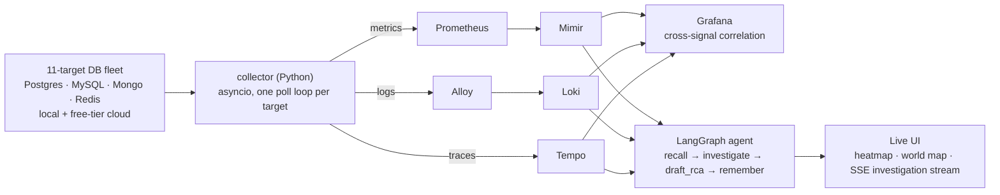

# Argus

**Can an agent actually investigate an incident, not just alert on one?**

Argus is an observability platform over a heterogeneous database fleet — Postgres, MySQL, MongoDB, Redis, local and free-tier cloud — with a real Prometheus/Mimir/Loki/Tempo/Grafana stack underneath, and a LangGraph agent on top that detects anomalies, investigates them across metrics/logs/traces, and writes the root-cause analysis itself.

Built to find out where that idea breaks. It broke twice, in ways worth reading about.

---

## Why this exists

Watching a database fleet closely, the failures that mattered weren't the ones crossing a threshold — they were the ones sitting comfortably inside it. A static SLO can only answer *"did this cross a line I chose?"* It has no way to answer *"is this behaving unlike itself?"* That gap is where most silent degradation lives, and it's what the anomaly detector exists to close.

The second question was harder: once something *is* flagged, can an agent do the triage work a human would — pull the metric, find the log line that explains it, confirm it against the trace — and be right? And once it's wrong, does it know how to stay wrong quietly, the way agents with memory tend to?

That second failure mode is the most interesting thing in this repo. See [§17.6](ARCHITECTURE.md#176-verification-status--verified-end-to-end).

---

## Architecture



Every hop is a real network call carrying real data — no mock paths, no fabricated values. `pg-supa`, `redis-cache`, and `redis-session` have genuinely broken credentials on purpose, and the whole stack reports them as `unreachable` rather than hiding or faking the gap. That distinction — a system that admits what it doesn't know — is most of the point. Full provenance audit: [§19](ARCHITECTURE.md#19-data-provenance--the-complete-audit).

Deployed to a local `kind` cluster, reconciled by ArgoCD from `k8s/` — a git push is the only deploy step.

---

## Two things that broke, and why they mattered more than what worked

**A recovered spike still needs to count as an incident.** The first anomaly detector scored only the newest data point. A 40-second chaos spike, checked a minute later, had already recovered — so nothing was ever flagged, even though it sat plainly in the data seconds earlier. Fixed by scoring the recent tail against its own baseline, not the latest sample. Small bug, but it's the difference between a detector that works in a demo and one that works in production, where nobody checks the moment a spike happens.

**Agent memory can turn one wrong answer into a self-reinforcing one.** The agent recalls past incidents to avoid re-investigating from scratch. Early on, a stale timestamp caused it to wrongly conclude a real signal "never occurred." That wrong verdict got saved as precedent. On the next investigation, it recalled its own mistake and cited it back as corroborating evidence — a low-confidence wrong answer became a high-confidence one, with no new information added.

The fix wasn't a bigger model. Only resolved incidents earn the right to become precedent, and the prompt states explicitly that precedent is a hypothesis to check, never evidence. Full writeup, plus two other production-shaped bugs (a metrics ring silently dropping data, a range query truncating the exact window being searched): [§17.6](ARCHITECTURE.md#176-verification-status--verified-end-to-end).

---

## What's running

| Layer | Tool | Role |
|---|---|---|
| Metrics | Prometheus → Mimir | scrape + durable long-term storage |
| Logs | Grafana Alloy → Loki | structured JSON, correlated by `trace_id` |
| Traces | OpenTelemetry → Tempo | one span per poll |
| Dashboards | Grafana | provisioned as code, two dashboards, six SLIs |
| Detection | `agent/detector.py` | rolling z-score, complements static SLOs |
| Investigation | `agent/graph.py` (LangGraph) | recall → investigate → draft_rca → remember |
| Deployment | Kubernetes (`kind`) + ArgoCD | GitOps, `prune: true`, `selfHeal: true` |
| UI | FastAPI + one static HTML file | live heatmap, world map, SSE investigation stream |

Nothing here is faked to look better on a dashboard. Where a tool is genuinely overkill at this scale (Mimir's single-binary mode, for instance), the docs say so directly instead of pretending otherwise — see the "honest note" sections throughout `BUILD_PLAN.md`.

---

## Quick start

```bash
docker compose up --build
```

No credentials needed — five local databases plus the full stack come up self-contained.

- Grafana → `localhost:3000`
- Prometheus → `localhost:9090`
- Collector metrics → `localhost:9100/metrics`

Generate load and watch a real breach:

```bash
pip install -r requirements.txt
cd loadgen
python generate.py baseline                      # leave running
python generate.py chaos pg-local --seconds 40    # in another terminal
```

Watch the detector and agent work, with zero token spend:

```bash
python -m agent.main scan          # one detector pass, no LLM calls
python -m agent.main investigate pg-local
python -m agent.main watch         # continuous detect + investigate
```

Live UI:

```bash
docker compose --profile ui up ui   # localhost:8080
```

To also monitor free-tier cloud instances (Neon, Atlas, Upstash), `cp .env.example .env` and fill in whichever DSNs you have — anything left unset is skipped, not required.

---

## Repo map

```
collector/    async collector — one independent poll loop per instance,
              engine-specific pollers, SLO classification, metrics+logs+traces
agent/        detector.py (z-score) + graph.py (LangGraph agent) + tools.py
ui/           FastAPI backend + single-file frontend, SSE investigation stream
deploy/       fleet.yaml (the fleet definition) + all provisioning-as-code
k8s/          raw manifests, reconciled by ArgoCD
loadgen/      baseline traffic + on-demand chaos, reads the same fleet.yaml
```

Adding a database is a YAML edit to `deploy/fleet.yaml`, not a code change — the collector and `loadgen` both read the same file.

---

## Status

Running end to end on a live cluster — metrics, logs, and traces flowing and correlated, the agent detecting and investigating real chaos runs, the UI streaming it live. Every piece here was picked against an alternative, not reached for by default: single-binary Mimir/Loki/Tempo over the distributed versions (this scale doesn't need them), no OpenTelemetry Collector in front of Tempo (nothing to fan out to yet), no Alertmanager (the detector already talks to the agent directly), files instead of pgvector for agent memory (recall here is filtered, not fuzzy).
